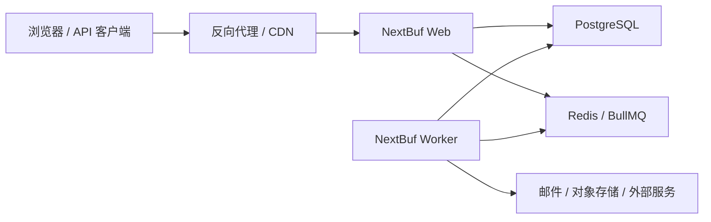

# 系统架构

## 1. 架构结论

**状态：已确定。**

NextBuf 采用模块化单体架构：前台、管理后台、服务端 API、领域服务和 Worker 位于一个代码仓库，构建为一个应用镜像。运行时将 Web 和 Worker 分为两个进程/容器。



模块化单体意味着：

- 一套仓库、一套版本、一套数据库迁移和一个应用镜像。
- 领域模块之间通过明确接口或领域事件协作。
- 不以 HTTP 在内部模拟微服务调用。
- Web 与 Worker 可以独立重启和扩容，但共享领域代码。

## 2. 技术基线

| 层面 | 选择 | 状态 | 说明 |
| --- | --- | --- | --- |
| 语言 | TypeScript 严格模式 | 已确定 | 前后台和 Worker 共享类型与领域代码 |
| Web | Next.js 16.2.11、App Router | 已确定 | 创建工程时锁定精确版本，升级需测试 |
| 运行时 | Node.js 24 LTS | 已确定 | 镜像和 CI 使用同一主版本 |
| 包管理 | pnpm，锁定 lockfile | 已确定 | CI 使用 `--frozen-lockfile` |
| UI | React、Tailwind CSS、shadcn/ui | 已确定 | 复用组件原语，不引入整套后台模板 |
| 数据库 | PostgreSQL 18 | 已确定 | 唯一官方支持的关系数据库 |
| ORM | Prisma 7 + PostgreSQL driver adapter | 已确定 | 常规模型与迁移使用 Prisma；复杂查询允许参数化 SQL |
| 缓存/队列 | Redis 8、BullMQ | 已确定 | 缓存、限流和队列使用不同 key 前缀 |
| 校验 | Zod | 已确定 | 已用于 Web、Worker、CLI 共享环境边界；后续扩展到表单和 API |
| 测试 | Vitest；Playwright + axe | 已确定 | Vitest 覆盖单元与真实服务集成；Playwright 覆盖 standalone、多视口、交互、截图与基础无障碍 |

Next.js 的最低 Node 要求不等于项目运行基线。选择 Node 24 LTS 是为了获得较长支持周期；发布包必须明确说明该要求。

## 3. 代码模块

建议的首批领域模块：

| 模块 | 责任 | 不应承担 |
| --- | --- | --- |
| `identity` | 用户、凭证、会话、OAuth 绑定 | 信任计算、内容权限 |
| `profiles` | 昵称、用户名、头像、简介、隐私 | 登录凭证 |
| `community` | 节点、主题、回复、编辑历史 | 封禁和举报流程 |
| `interactions` | 收藏、关注、点赞、阅读状态 | 直接修改信任等级 |
| `notifications` | 通知偏好、站内通知、邮件意图 | 直接发送全部邮件 |
| `moderation` | 举报、处置、警告、封禁、审核队列 | 身份认证实现 |
| `trust` | 等级规则、周期计算、能力映射 | 管理员角色 |
| `settings` | 站点配置、功能开关、Provider 配置 | 任意业务表的写入 |
| `audit` | 不可变的关键操作记录 | 普通业务日志 |
| `jobs` | 队列定义、调度、重试和任务状态 | 重复实现领域规则 |

路由组件、Route Handler 和 Server Action 只负责：认证上下文、输入解析、调用应用服务、将结果转换为页面或响应。领域规则不能散落在 React 组件中。

## 4. 前台与后台

前台和后台都由 App Router 提供：

```text
src/app/
  (site)/        前台页面
  admin/         管理后台
  api/           公开或集成 API
```

后台不是独立 SPA，也不使用通用 CRUD 后台框架作为系统核心。原因是社区后台包含举报合并、内容处置、信任调整、封禁和审计等领域流程，通用后台只能减少表格样板代码，不能替代这些规则。

可以复用成熟基础库：数据表格、表单校验、图表、编辑器和无障碍组件。任何库都不能绕开统一授权服务。

NextBuf 不建立顶层 `frontend/` 和 `backend/` 两个工程。界面层位于 `src/app`、`src/components`，服务端业务位于 `src/modules`、`src/infrastructure`，异步入口位于 `src/worker`。详细边界见 [仓库结构与模块边界](./10-repository-structure.md)。

## 5. Web 与 Worker 边界

### Web 负责

- 服务端渲染页面和静态资源。
- 接收表单、API 请求和 Webhook。
- 执行需要立即返回的事务。
- 创建异步任务意图。
- 查询任务状态，但不在请求中执行长耗时工作。

### Worker 负责

- 发送邮件和批量通知。
- 生成摘要、预览、图片派生资源。
- 重新计算热门度、统计和信任等级。
- 清理过期会话、令牌和临时数据。
- 重试外部服务调用。
- 执行周期性维护任务。

Web 与 Worker 使用相同镜像：

```text
web:    node server.js
worker: node worker.js
```

不得在 Web 容器内使用后台 `&` 命令临时拉起 Worker。非 Docker 环境也应由 systemd 或 PM2 分别监督两个进程。

## 6. 事务与异步一致性

仅在数据库事务提交后直接调用 `queue.add()` 会留下一个故障窗口：数据已提交，但任务可能未入队。因此关键异步动作采用事务性 Outbox：

1. 业务数据和 `outbox_event` 在同一 PostgreSQL 事务中提交。
2. Dispatcher 读取未发布事件并写入 BullMQ。
3. 发布成功后记录时间和尝试次数。
4. Worker 使用稳定任务 ID 和幂等键消费。
5. 邮件、Webhook、统计等副作用记录处理结果，重复执行不会产生重复效果。

非关键、可自然过期的缓存刷新可以直接入队，但必须清楚标记其可靠性等级。

`v0.9.0` 已将回复、提及、主题关注回复和管理动作转换为版本化通知 Outbox。Worker 生成结构化 Notification 与渠道投递记录，普通邮件继续拆成独立加密 EmailDelivery/Outbox。BullMQ 最终失败、重放请求和周期任务租约保存在 PostgreSQL；Redis 清空后不丢失通知意图、死信证据或调度计划。受限的 `/admin/worker` 只向站点 `admin` 展示队列摘要和重放入口，不是通用 CRUD 后台。详细边界见 [ADR-0012](./adr/0012-notifications-mail-worker-operations.md)。

`v0.10.0` 的举报、案件、处置、制裁、角色和信任状态同样以 PostgreSQL 为事实来源。Web 写入信任 preview/apply 批次和事务性 Outbox，独立 Worker 按 UID 游标分片重算；Redis 只负责可恢复执行。制裁授权同步读取数据库，不经过异步缓存；`/admin/moderation` 只是聚焦案件工作台，完整管理后台仍属于 `v0.11.0`。详细边界见 [ADR-0013](./adr/0013-governance-roles-trust.md)。

`v0.11.0` 已在同一模块化单体中增加完整后台壳、运营仪表盘、用户/内容/节点工作台、PostgreSQL 站点设置、Provider 脱敏诊断和统一审计查询/导出。后台 Route Handler 仍只是输入边界；所有查询和写入进入 `server-only` 管理/设置服务。高风险操作绑定当前 Better Auth Session 的短时二次验证，部署密钥仍由环境变量提供。详细边界见 [ADR-0014](./adr/0014-administration-settings-and-reauthentication.md)。

`v0.12.0` 把同一模块化单体打包为一个 amd64/arm64 镜像和非 Docker x64 归档。Web/Worker 仍是独立进程，但共享 setup/preflight、迁移全集、版本检查和配置 Schema；PostgreSQL 的 `runtime.initialized` 阻止失败初始化后的带病启动，一次性 `SETUP_TOKEN` 只保护 Better Auth 首位管理员流程。备份、恢复与升级边界见 [ADR-0015](./adr/0015-production-packaging-setup-and-recovery.md)。

## 7. 数据与缓存原则

- PostgreSQL 是业务事实来源，Redis 不是永久数据存储。
- 缓存必须有 TTL，并能在 Redis 清空后自动恢复。
- 队列任务参数只保存执行所需的标识和版本，不复制整份敏感对象。
- 计数器允许短暂延迟，但权限、封禁和付款类判断不得依赖可能过期的缓存。
- 所有时间在数据库中使用 UTC，界面按用户或站点时区显示。
- 业务主键使用内部 ID；公开数字 UID 单独生成，避免暴露可推断的表关系。

## 8. 搜索与存储

### 搜索

`v0.8.0` 已使用 PostgreSQL `simple` FTS、`pg_trgm`、表达式 GIN 索引和参数化 SQL 实现标题、Markdown 源正文、用户公开身份/简介和节点搜索。搜索模块通过 `SearchProvider` 内部接口封装，并统一过滤非公开节点、软删除/隐藏内容和非 active 用户。V2 及以后可增加 Meilisearch 或 OpenSearch Provider，但不能移除 PostgreSQL 降级路径或改变可见性语义。

### 文件存储

存储接口至少支持：

- 本地持久化目录，适合单机和开发环境。
- S3 兼容对象存储，适合生产和多实例。

数据库只保存对象键、元数据和所有权，不保存大文件本体。上传必须校验 MIME、扩展名、大小和访问权限。

## 9. 扩展策略

V1 不执行任意第三方服务端插件，但从开始保留：

- 稳定的领域事件名称和版本。
- 邮件、存储、搜索、OAuth 等 Provider 接口。
- 管理后台导航和设置页的受控扩展点。
- 功能开关和数据库能力检测。

V3 插件系统需要单独设计清单、兼容范围、权限声明、迁移、启停、升级和失败隔离。插件默认视为受信任服务端代码，不能以“沙箱”作为未经验证的安全承诺。

## 10. 可观测性

- Web 和 Worker 输出结构化 JSON 日志，包含请求 ID、用户 ID（可脱敏）、任务 ID和错误码。
- `/health/live` 只判断进程存活，不访问外部依赖。
- `/health/ready` 检查必要的数据库和 Redis 连接。
- Worker 提供队列积压、失败数、重试数和处理耗时指标。
- 管理后台展示业务级失败任务，但不能向普通管理员暴露密钥或完整异常环境。
- 后续可以通过 OpenTelemetry 输出追踪和指标，V1 不强制部署独立观测平台。
