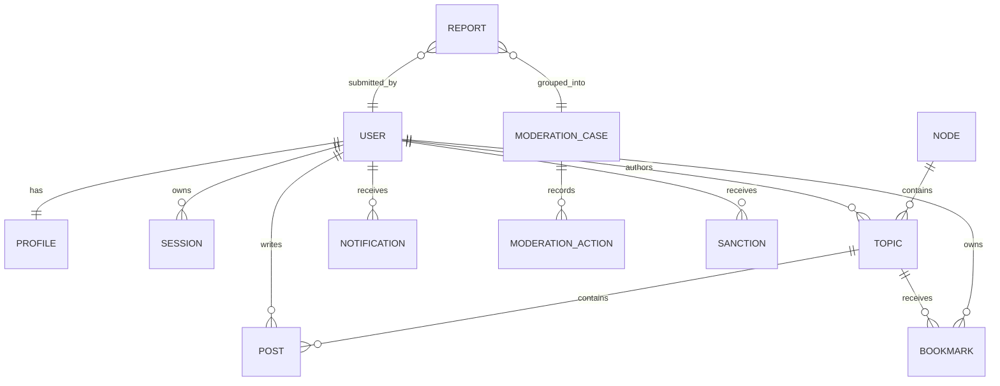

# 领域模型

本文定义业务概念和数据所有权，不是最终 Prisma Schema。字段命名可在实现时调整，但语义和边界变更必须同步更新本文。

## 1. 建模原则

- 每个业务对象有内部主键，面向用户的 UID、slug 等是独立稳定标识。
- 使用数据库外键和唯一约束保证核心一致性，不能只靠 TypeScript 校验。
- 删除优先采用软删除并保留审计信息；隐私清除另走不可逆流程。
- 状态变化通过应用服务完成，禁止页面组件直接拼接更新。
- 统计值可以异步更新，权限和所有权判断必须读取可靠来源。
- 数据模型为 PostgreSQL 设计，不承诺 MySQL 或 SQLite 兼容。

## 2. 用户与身份

### User

账号主体，包含：

- UUID 是内部主键；`uid` 是从独立 PostgreSQL 序列分配的公开数字标识，从 1000 起、不可修改、不可复用。
- `username` 是唯一规范化用户名；`name` 是可重复昵称；邮箱、邮箱验证和账号状态沿用 Better Auth 语义。
- `usernameChangedAt` 记录 30 天修改冷却起点；`deletionRequestedAt` 与 `deletionScheduledAt` 记录 14 天可撤销注销申请。
- 账号状态：`pending`、`active`、`restricted`、`suspended`、`deleted`。
- `v0.5.0` 已实现 `pending` 和 `active` 主链路；restricted、suspended、最终匿名化/删除、最后活动和持久化信任等级属于后续版本。

### Profile

公开资料，包含：

- 与 User 一对一，以 `userId` 为主键并级联删除；迁移为既有用户回填，数据库触发器为任何新用户自动创建。
- 简介、HTTP/HTTPS 个人主页、资料公开开关和活动统计展示开关。
- 头像 URL 当前保存在 `User.image` 以保持 Better Auth 兼容；文件由可替换的存储边界管理。

用户名比较使用小写规范化值并建立唯一索引。`UsernameAlias` 永久归原用户所有；用户名变更后旧 `/u/<username>` 链接重定向到当前主页，其他用户不能抢注历史名称。只有 `active` 账号可通过公开用户页解析。

### UsernameAlias

- 保存历史 `username`、所属用户和创建时间。
- 历史名称与当前用户名在应用服务中共同做占用检查；数据库触发器使用事务级 advisory lock 串行化同名写入，并跨两张表拒绝不同用户的冲突，表内唯一索引继续负责最终兜底。
- 用户切回自己的历史名称时，该名称从别名恢复为当前用户名，同时刚离开的名称进入别名表。
- 后续最终注销流程必须先定义匿名化与法务保留策略，不能通过简单级联删除意外释放历史用户名。

### Account、Session、Verification

- `Account` 保存 Better Auth credential 或 OAuth Provider 绑定；credential 密码字段保存 scrypt 哈希，不保存明文密码。
- `Session` 保存可撤销会话、有效期和必要的设备信息。
- `Verification` 统一承载邮箱验证和密码重置记录，identifier 经 HMAC-SHA256 后落库并设置短有效期。
- `RegistrationInvite` 只保存邀请码 HMAC、最大次数、使用次数、有效期和禁用时间。
- `IdentityAuditEvent` 保存身份安全事件、关联用户/会话和 HMAC 后的 IP。
- `EmailDelivery` 保存收件人、主题、状态和 AES-256-GCM 加密正文；实际发送由 Outbox Worker 完成。

认证数据归 `identity` 模块所有，业务模块只通过用户 ID 和认证上下文引用。

## 3. 节点

### Node

节点是 V1 的主要内容分类：

- 名称、slug、简介、图标或色标。
- 排序、可见状态和归档状态。
- 发帖、回复和查看所需的权限策略。
- 默认版主范围和内容规则引用。

每个主题在 V1 必须属于一个节点。节点删除前必须迁移主题或转为归档，不能产生无节点主题。

### 标签

V1 不实现用户标签系统，节点是唯一主要内容分类。后续版本如果增加管理员标签或用户标签，它们只能作为可选辅助分类，不能替代节点，也不能改变既定主题列表信息层级。

## 4. 主题与回复

### Topic

主要字段：

- 作者、节点、标题、正文源内容。
- 状态：`draft`、`published`、`closed`、`hidden`、`deleted`。
- 管理标志：置顶、精华。
- 统计快照：回复数、浏览数、收藏数、最后回复时间。
- 创建、发布、编辑、关闭和软删除时间。

“热门”默认是根据时间衰减、互动和治理信号计算的展示结果，不建议作为永久手工布尔值。管理员可有单独的推荐能力，但必须与算法热门区分。

### Post

V1 使用统一 `Post` 表：`Topic` 保存节点、标题、状态和聚合元数据；首帖是 `position = 1` 的 Post，后续回复依次获得稳定 position。创建主题和首帖必须在同一个数据库事务内完成。

该模型必须保证：

- 同一主题内楼层号稳定且唯一。
- 回复可以引用某一内容版本或至少记录被引用对象。
- 软删除后楼层关系不坍缩。
- 管理员可查看删除原因，普通用户看不到敏感内容。

### Revision

主题和回复编辑后保存修订：编辑者、编辑时间、来源、修改原因以及必要的内容快照。自动格式化等无意义变化可合并，避免无限产生修订。

### 内容格式

V1 建议保存 Markdown 源内容。渲染时执行允许列表清洗，默认禁止原始 HTML、危险 URL 协议、脚本和内联事件。渲染缓存可以重建，源内容是事实来源。

## 5. 互动

### Like

V1 只实现单一“赞”，不建立多反应类型。同一用户对同一内容最多一条有效记录，由数据库唯一约束保证。取消操作保留业务事件但不必永久保留一条活动记录。

### Bookmark

收藏属于用户私有数据，可附加备注或提醒时间。主题被软删除后，收藏记录可保留但不再暴露内容。

### Follow

关注目标至少包括主题和用户；节点关注可在 V1 后期加入。通知模块根据关注关系和用户偏好生成通知意图。

### View

浏览量是反滥用后的聚合结果，不等于每次 HTTP 请求。原始浏览事件应限量、采样或定期清理，不能无限增长。

## 6. 通知

### Notification

站内通知包括：

- 接收者、类型、触发者。
- 目标对象类型和 ID。
- 已读、创建和归档时间。
- 用于稳定渲染的最小快照。

通知内容不能只保存一段不可解释的最终文本；类型和结构化数据便于多语言、跳转与后续模板升级。

### NotificationPreference

用户可分别控制站内、邮件和未来推送渠道。安全类邮件不能被普通偏好完全关闭。

通知创建和渠道投递分开：业务事件生成站内通知及投递意图，Worker 再发送邮件。邮件失败不回滚已经发布的回复。

## 7. 治理与风控

### Report

举报包含举报人、目标、原因、补充信息和状态。相同目标的举报可以聚合展示，但每次举报仍需保留来源，便于识别滥用举报。

### ModerationCase

一次治理事件可以关联多个举报和多个动作。状态建议为：`open`、`investigating`、`resolved`、`dismissed`。

### ModerationAction

处置动作包括隐藏、恢复、关闭、警告、限流、禁言、封禁等。记录操作者、目标、原因、有效期、关联案件和前后状态。

### Sanction

对用户生效的限制独立建模，包含类型、范围、开始/结束时间和撤销信息。不要只在 User 表放一个 `isBanned`，否则无法表达节点禁言、临时封禁和历史记录。

### AuditLog

关键管理行为的应用级追加日志：

- 操作者及其当时角色。
- 动作、对象、结果和原因。
- 请求 ID、时间、必要的 IP/设备摘要。
- 不包含密码、令牌和完整敏感配置。

审计记录默认不能通过普通后台删除；隐私和法务要求下的处理需要专门流程。

## 8. 设置与功能开关

设置分三类：

- 启动配置：数据库、Redis、加密密钥等，只来自环境或秘密管理系统。
- 站点设置：名称、注册策略、主题限制等，保存在数据库并经过类型校验。
- 用户偏好：通知、界面和隐私选项，归用户所有。

敏感值不能明文展示在后台。可在线修改的 Provider 密钥必须加密保存，并要求实例级主密钥才能解密。

功能开关必须有默认值、所有者和移除计划，不能成为永久死代码仓库。

## 9. 关键关系

该图省略修订、反应、关注、角色、信任历史和 Outbox 等辅助实体。

## 10. 数据生命周期

- 草稿可由用户删除，并按配置定期清理。
- 已发布内容采用软删除，以保持回复关系、举报证据和审计一致性。
- 用户注销先撤销会话和凭证，再按政策匿名化或延迟删除公开资料。
- 安全日志、审计日志、任务日志和浏览事件具有不同保留期。
- 附件删除要经过引用检查和延迟回收，避免编辑或恢复内容后文件丢失。
- 备份保留期与在线数据删除不是同一概念，隐私政策必须说明备份中的延迟清除。
