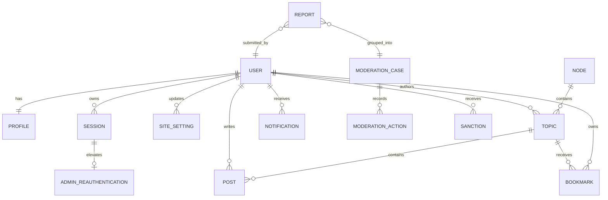

# 领域模型

本文定义业务概念和数据所有权，不是最终 Prisma Schema。字段命名可在实现时调整，但语义和边界变更必须同步更新本文。

## 1. 建模原则

- 每个业务对象有内部主键，面向用户的 UID、slug 等是独立稳定标识。
- 使用数据库外键和唯一约束保证核心一致性，不能只靠 TypeScript 校验。
- 删除优先采用软删除并保留审计信息；隐私清除另走不可逆流程。
- 状态变化通过应用服务完成，禁止页面组件直接拼接更新。
- 统计值可以异步更新，权限和所有权判断必须读取可靠来源。
- 数据模型为 PostgreSQL 设计，不承诺 MySQL 或 SQLite 兼容。

## 2. 用户与身份

### User

账号主体，包含：

- UUID 是内部主键；`uid` 是从独立 PostgreSQL 序列分配的公开数字标识，从 1 起、不可修改、不可复用。早期 Beta 已分配 UID 保持不变。
- `username` 是唯一规范化用户名；`name` 是可重复昵称；邮箱、邮箱验证和账号状态沿用 Better Auth 语义。
- `usernameChangedAt` 记录 30 天修改冷却起点；`deletionRequestedAt` 与 `deletionScheduledAt` 记录 14 天可撤销注销申请。
- 账号状态：`pending`、`active`、`restricted`、`suspended`、`deleted`。
- `v0.10.0` 起暂停/封禁会同步写入 `suspended`，撤销或到期后由受审计服务/周期维护恢复；最终匿名化/删除和最后活动仍属于后续版本。持久化信任状态位于独立 `TrustUserState`，不写入 User 角色字段。

### Profile

公开资料，包含：

- 与 User 一对一，以 `userId` 为主键并级联删除；迁移为既有用户回填，数据库触发器为任何新用户自动创建。
- 简介、HTTP/HTTPS 个人主页、资料公开开关和活动统计展示开关。
- 头像 URL 当前保存在 `User.image` 以保持 Better Auth 兼容；文件由可替换的存储边界管理。

用户名比较使用小写规范化值并建立唯一索引。`UsernameAlias` 永久归原用户所有；用户名变更后旧 `/u/<username>` 链接重定向到当前主页，其他用户不能抢注历史名称。只有 `active` 账号可通过公开用户页解析。

### UsernameAlias

- 保存历史 `username`、所属用户和创建时间。
- 历史名称与当前用户名在应用服务中共同做占用检查；数据库触发器使用事务级 advisory lock 串行化同名写入，并跨两张表拒绝不同用户的冲突，表内唯一索引继续负责最终兜底。
- 用户切回自己的历史名称时，该名称从别名恢复为当前用户名，同时刚离开的名称进入别名表。
- 后续最终注销流程必须先定义匿名化与法务保留策略，不能通过简单级联删除意外释放历史用户名。

### Account、Session、Verification

- `Account` 保存 Better Auth credential 或 OAuth Provider 绑定；credential 密码字段保存 scrypt 哈希，不保存明文密码。
- `Session` 保存可撤销会话、有效期和必要的设备信息。
- `Verification` 统一承载邮箱验证和密码重置记录，identifier 经 HMAC-SHA256 后落库并设置短有效期。
- `RegistrationInvite` 只保存邀请码 HMAC、最大次数、使用次数、有效期和禁用时间。
- `IdentityAuditEvent` 保存身份安全事件、关联用户/会话和 HMAC 后的 IP。
- `EmailDelivery` 保存收件人、主题、状态和 AES-256-GCM 加密正文；实际发送由 Outbox Worker 完成。

认证数据归 `identity` 模块所有，业务模块只通过用户 ID 和认证上下文引用。

## 3. 节点

### Node

节点是 V1 的主要内容分类：

- 名称、slug、简介、图标或色标。
- 排序、可见状态和归档状态。
- 发帖、回复和查看所需的权限策略。
- 默认版主范围和内容规则引用。

每个主题在 V1 必须属于一个节点。节点删除前必须迁移主题或转为归档，不能产生无节点主题。

`v0.6.0` 已实现 `community_nodes`：UUID 内部主键、唯一 slug、名称、简介、颜色、图标、排序值、`public/hidden` 可见性和归档时间。早期迁移曾初始化六个 NextBuf 主题节点；`v0.13.1` 为通用开源发行版追加迁移，空安装不再保留这些分类，管理员通过 `/admin/nodes` 创建自己的节点。已有用户、内容或自定义节点的实例不会被迁移删除。公开查询按排序值和名称稳定排序；归档节点仍可浏览历史主题但不能新建或移动主题，隐藏节点不进入公开目录。

### 标签

V1 不实现用户标签系统，节点是唯一主要内容分类。后续版本如果增加管理员标签或用户标签，它们只能作为可选辅助分类，不能替代节点，也不能改变既定主题列表信息层级。

## 4. 主题与回复

### Topic

主要字段：

- 作者、节点、标题、正文源内容。
- 状态：`draft`、`published`、`closed`、`hidden`、`deleted`。
- 管理标志：置顶、精华。
- 统计快照：回复数、浏览数、收藏数、最后回复时间。
- 创建、发布、编辑、关闭和软删除时间。

“热门”默认是根据时间衰减、互动和治理信号计算的展示结果，不建议作为永久手工布尔值。管理员可有单独的推荐能力，但必须与算法热门区分。

`v0.6.0` 起的实现细节：

- `id` 是 UUID 内部主键，`number` 是不可变、递增且不复用的公开主题编号；URL 使用 `/topics/<number>`，授权仍使用用户和 UUID 关系。
- 状态为 `draft`、`published`、`closed`、`hidden`、`deleted`；软删除额外保存删除前状态，以便恢复到草稿、发布、关闭或隐藏状态。
- 置顶和精华是明确管理标志；热门不落库。`v0.8.0` 使用回复、独立参与者、点赞、收藏、去重浏览和时间衰减计算热门算法 v1，各信号有独立上限。
- 首页和节点流只公开 `published/closed`，按置顶、最后活动时间和主题编号稳定排序，使用包含这三个排序键的 opaque cursor 前后翻页。
- 浏览量由 `v0.8.0` 的 30 分钟访问者哈希桶与 Outbox Worker 异步聚合，不按每次 Topic GET 直接增长。

### Post

V1 使用统一 `Post` 表：`Topic` 保存节点、标题、状态和聚合元数据；首帖是 `position = 1` 的 Post，后续回复依次获得稳定 position。创建主题和首帖必须在同一个数据库事务内完成。

该模型必须保证：

- 同一主题内楼层号稳定且唯一。
- 回复可以引用某一内容版本或至少记录被引用对象。
- 软删除后楼层关系不坍缩。
- 管理员可查看删除原因，普通用户看不到敏感内容。

`v0.6.0` 创建主题时在同一 PostgreSQL 事务中创建 Topic、position=1 的首帖和 version=1 修订。主题级删除、隐藏和恢复只同步首帖状态，不批量覆盖普通回复自己的删除状态。

`v0.7.0` 已开放普通回复：Topic 的 `nextPostPosition` 在 Topic 行锁内单调分配，数据库唯一约束兜底，同一 Topic 的回复从 position=2 开始且永不复用。回复创建同时写入初始修订、提及、附件引用、有效回复计数和审计；每用户每小时最多 20 条，由锁定用户行的 PostgreSQL 事务限制。回复支持同 Topic 引用、编辑、软删除和恢复，删除只减少有效回复数并保留楼层。回复列表每页读取 30 个实际 Post，包括删除墓碑。

### Revision

主题和回复编辑后保存修订：编辑者、编辑时间、来源、修改原因以及必要的内容快照。自动格式化等无意义变化可合并，避免无限产生修订。

当前每次标题或正文实际变化都会增加单调版本号，保存标题（回复为空）、正文快照、编辑者、来源和时间；仅节点移动、引用未变化或状态管理不会制造伪内容版本。修订与当时引用的附件建立不可变关系，后续正文移除附件也不会破坏历史版本。

### 内容格式

`v0.7.0` 保存 Markdown 源内容，并让编辑器预览与正式页面共用服务端 remark/rehype 渲染管线。支持 GFM，禁用原始 HTML，按允许列表清洗生成 HTML，移除危险协议；站外链接增加安全 `rel`，站外图片降级为链接，只有内部附件媒体路由可以嵌入图片。渲染结果可重建，`bodySource` 始终是事实来源。

`@username` 在非链接和非代码文本中解析为用户页链接；当前有效且 active 的用户写入去重 Mention 关系。`v0.7.0` 只保存提及事实；`v0.9.0` 起由回复 Outbox 的 Worker 从该事实派生通知。

### Draft 与 Attachment

- 每个用户在每个 Topic 最多一份回复草稿，自动保存覆盖同一行；显式发布会等待正在执行的自动保存，并在发布事务中删除草稿引用。
- Attachment 保存上传者、实际 storage driver、随机原始键、派生键、签名识别 MIME、大小、SHA-256、处理状态、图片尺寸和失败原因。
- 支持 PNG、JPEG、WebP、PDF、UTF-8 文本和 ZIP；默认单文件 20 MiB、图片最多 4000 万像素、每用户每小时最多 20 个上传。
- 当前 Post、不可变 Revision 和 Draft 使用三张关系表引用附件。引用建立和延迟回收锁定同一 Attachment 行，避免文件在被重新引用时删除。
- 图片原件保留，Worker 生成去元数据 WebP 派生文件；无任何引用的附件经过默认 24 小时宽限期后由 Outbox Worker 回收。
- ready 且被公开主题的 published Post 引用时允许匿名读取；未公开、pending 或 failed 文件仅上传者可读取原始内容。

## 5. 互动

### Like

V1 只实现单一“赞”，不建立多反应类型。`v0.8.0` 使用 `interaction_post_likes` 复合主键保证同一用户对同一 Post 最多一条记录；Post `like_count` 只在关系真实新增/删除时同事务变化。`PUT/DELETE` 重复请求幂等，Redis 不保存点赞事实。

### Bookmark

收藏属于用户私有数据。`v0.8.0` 实现主题收藏和派生 `bookmark_count`；主题被软删除后记录可保留，但个人列表不再暴露主题内容。备注和提醒时间尚未实现。

### Follow

`v0.8.0` 实现用户关注和主题关注，数据库禁止用户关注自己。关注关系本身只建立事实和个人列表；`v0.9.0` 起新回复会从真实 TopicFollow 事实派生关注主题通知。节点关注尚未实现。

### ReadState

`interaction_topic_read_states` 保存每用户每 Topic 的最大已读楼层、最近阅读时间和更新时间。查看更早页面不会降低最大已读楼层；主题流通过最近阅读时间与 Topic 最后活动时间判断是否有新内容。

### View

浏览量是反滥用后的聚合结果，不等于每次 HTTP 请求。`v0.8.0` 对登录用户 ID 或匿名 IP/用户代理组合做领域分离 HMAC，仅保存哈希；同一 Topic/哈希/30 分钟桶只接受一次。Outbox Worker 幂等增加 `view_count`，已聚合桶保留 30 天并限量清理。详细决策见 [ADR-0011](./adr/0011-interactions-search-discovery.md)。

## 6. 通知

### Notification

站内通知包括：

- 接收者、类型、触发者。
- 目标对象类型和 ID。
- 已读、创建和归档时间。
- 用于稳定渲染的最小快照。

通知内容不能只保存一段不可解释的最终文本；类型和结构化数据便于多语言、跳转与后续模板升级。

`v0.9.0` 实际类型为提及、直接回复、关注主题回复和主题管理动作。回复事件对同一 Post/接收者使用稳定去重键，提及优先于直接回复，直接回复优先于关注主题回复，并排除触发者本人。通知通过 `in_app`/`email` 投递记录保存事件发生时的 delivered、queued、skipped 或 failed 结果。

### NotificationPreference

用户可分别控制站内、邮件和未来推送渠道。安全类邮件不能被普通偏好完全关闭。

通知创建和渠道投递分开：业务事件生成站内通知及投递意图，Worker 再发送邮件。邮件失败不回滚已经发布的回复。

缺少显式偏好时站内渠道默认开启、普通邮件默认关闭。偏好只影响之后产生的普通通知，不追溯投递历史；邮箱验证和密码重置属于安全邮件，不读取普通偏好。失败任务、重放请求和带租约的周期任务同样持久化在 PostgreSQL，具体语义见 [ADR-0012](./adr/0012-notifications-mail-worker-operations.md)。

## 7. 治理与风控

### Report

举报包含举报人、目标、原因、补充信息和状态。相同目标的举报可以聚合展示，但每次举报仍需保留来源，便于识别滥用举报。

`v0.10.0` 的 `ModerationReport` 目标只能是公开用户、公开主题或公开回复，并保存稳定 `target_key`、目标快照、举报者当时 TL 和权重。同一用户对同一目标只能有一条未结举报，每用户 UTC 日最多 10 条；结案后活动键置空，历史记录不删除。

### ModerationCase

一次治理事件可以关联多个举报和多个动作。实际状态为：`open`、`in_review`、`resolved`、`dismissed`。同一 `active_target_key` 最多一个未结案件；案件优先级按独立举报权重累加，但不直接代表目标有罪。

### ModerationAction

处置动作包括隐藏、恢复、关闭、警告、节点/全站禁言、临时暂停、永久封禁、撤销和结案。每条不可变记录包含操作者、操作者当时角色、目标、原因、有效期、关联案件、前后状态和请求 ID。

### Sanction

对用户生效的限制独立建模，实际类型为 `warning`、`node_mute`、`site_mute`、`suspend`、`ban`，包含范围、开始/结束时间、创建动作和撤销信息。节点/全站禁言只阻止新内容，暂停/封禁阻止账号能力并同步 User.status；授权每次读取 PostgreSQL 当前有效制裁，不依赖 Redis。

### AuditLog

关键管理行为的应用级追加日志：

- 操作者及其当时角色。
- 动作、对象、结果和原因。
- 请求 ID、时间、必要的 IP/设备摘要。
- 不包含密码、令牌和完整敏感配置。

审计记录默认不能通过普通后台删除；隐私和法务要求下的处理需要专门流程。

### RoleAssignment

基础用户是隐式角色。`CommunityRoleAssignment` 显式保存 `admin`、`global_moderator` 和限定节点的 `node_moderator`，包含授予人、原因与作用域唯一键。角色变更只允许管理员，撤销最后一个管理员会被拒绝；角色不由 TL 自动产生。

### TrustRuleVersion、TrustUserState 与 TrustLevelHistory

`TrustRuleVersion` 保存不可变版本号、状态和 JSON 规则。任意时刻只有一个 active 规则；draft 必须先完成 preview 批次才可激活，旧 active 规则转为 retired。

`TrustUserState` 与 User 一对一，保存当前等级、自动等级、可空的人工 TL4、规则版本、指标、解释、宽限截止和计算时间。数据库约束保证自动等级只在 TL0-TL3，人工等级只能是 TL4，当前等级始终等于人工覆盖或自动等级。

默认规则 v1 使用账号天数、已读主题数、有效主题/回复数、收到点赞数和 180 天内未撤销制裁数。TL1、TL2、TL3 阈值分别为 `1/3/1/0/0`、`14/20/10/3/0`、`60/100/50/20/0`。升级立即生效；自动降级先保留原等级并进入 14 天宽限。

`TrustLevelHistory` 记录等级或宽限变化时的规则、指标、解释、前后等级、自动等级、来源、可选批次和人工操作者。TL 不授予节点版主、全局版主或管理员，也不承载专业声誉和交易信用。

### TrustRecalculationBatch

规则预估和应用都保存独立批次，包含总数、已处理数、变化数、UID 游标、影响分布、状态和错误。Worker 每个 Outbox 分片最多处理 25 个 UID，下一分片与当前进度在同一事务提交；Redis 丢失后仍可从未发布 Outbox 和数据库游标恢复。

## 8. 设置与功能开关

设置分三类：

- 启动配置：数据库、Redis、加密密钥等，只来自环境或秘密管理系统。
- 站点设置：名称、注册策略、主题/回复/上传开关和每小时限额，保存在数据库并经过类型校验。
- 用户偏好：通知、界面和隐私选项，归用户所有。

`v0.11.0` 使用单例 `SiteSetting(id=site)`，显式保存 `revision`、站点名称、注册模式、三个发布开关、三个每小时上限和最后修改者。写入锁定单例行并检查期望修订号；数据库 CHECK 与 Zod 同时限制名称、枚举和数值范围。主题、回复和附件创建事务直接读取该事实，Redis 不参与正确性判断。

SMTP、S3 和 OAuth Secret 属于启动配置，不进入 `SiteSetting`。后台只返回脱敏状态并执行固定 Provider 的服务端连接测试。敏感值不能明文展示、导出或写入浏览器日志。

`AdminReauthentication` 以 Better Auth `Session.id` 为主键，只保存验证时间和十分钟过期时间。Session 删除时级联删除该状态；它不是第二套会话、Cookie 或认证主体。

功能开关必须有默认值、所有者和移除计划，不能成为永久死代码仓库。

## 9. 关键关系

该图省略修订、反应、关注、角色、信任历史和 Outbox 等辅助实体。

## 10. 数据生命周期

- 草稿可由用户删除，并按配置定期清理。
- 已发布内容采用软删除，以保持回复关系、举报证据和审计一致性。
- 用户注销先撤销会话和凭证，再按政策匿名化或延迟删除公开资料。
- 安全日志、审计日志、任务日志和浏览事件具有不同保留期。
- 附件删除要经过引用检查和延迟回收，避免编辑或恢复内容后文件丢失。
- 备份保留期与在线数据删除不是同一概念，隐私政策必须说明备份中的延迟清除。
