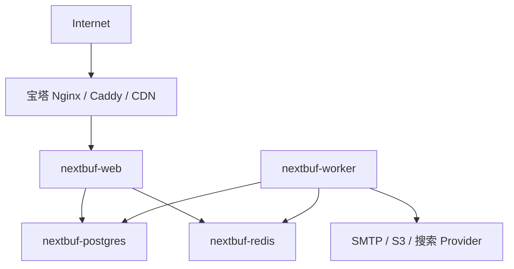

# 部署与运维

本文件定义部署架构和运维原则。逐步安装、升级、备份、恢复和故障排查见 [安装与运维运行手册](./13-installation-operations-runbook.md)。

> 当前实现状态：`v0.13.5` 公开 Beta 已交付生产打包、首次管理员、通用空节点安装、UID 从 1 开始、官方 shadcn/ui 管理后台、备份恢复、精确升级和无需 `.env`、固定容器名的宝塔单文件 Compose。Mailpit 只用于开发、测试和 CI，不是第五个生产容器。生产与恢复合同见 [ADR-0015](./adr/0015-production-packaging-setup-and-recovery.md)，面板启动协调见 [ADR-0016](./adr/0016-panel-friendly-compose-bootstrap.md)，单文件面板入口见 [ADR-0017](./adr/0017-single-file-panel-compose.md)。

## 1. 部署目标

NextBuf 的发布方式必须同时服务两类用户：

- 希望在宝塔面板中导入 Compose、填写配置并点击启动的站长。
- 需要外部数据库、多实例、自动发布和可观测性的专业运维团队。

两类用户使用同一个应用镜像和配置模型。简单部署不是另一套代码，专业部署也不要求迁移到“企业版”。

## 2. 默认拓扑：四个常驻容器

**状态：已确定。**



常驻服务：

| 服务 | 镜像 | 对外端口 | 持久化 | 责任 |
| --- | --- | --- | --- | --- |
| `nextbuf-web` | NextBuf 应用镜像 | 3000，可映射到宿主机回环地址 | 可选本地上传目录 | 页面、后台、API |
| `nextbuf-worker` | 与 Web 相同 | 无 | 可选本地上传目录 | 队列和周期任务 |
| `nextbuf-postgres` | 官方 PostgreSQL 镜像 | 默认不对公网发布 | 必需 | 业务事实数据 |
| `nextbuf-redis` | 官方 Redis 镜像 | 默认不对公网发布 | 建议 AOF | 缓存、限流、BullMQ |

幂等 `setup` 负责迁移、运行时初始化和周期任务注册。默认单机 Compose 由 Web 在启动前执行 setup 和 preflight，Worker 等待 Web 健康；`setup` 服务只放在工具 profile 中供升级、恢复和人工命令使用，因此面板默认不会创建第五个停止容器。

## 3. 为什么不是三个容器

Discourse 可以把 Web 和 Sidekiq 放在同一个应用容器，因为它使用 runit 等机制监督多个进程。这是成熟且有效的封装方式，但不是容器数越少越先进。

NextBuf 将 Web 和 Worker 分开，原因是：

- Node Web 与 BullMQ Worker 是两个独立长生命周期进程。
- Worker 的崩溃、任务峰值或内存压力不应直接影响页面可用性。
- 两者需要不同的健康检查、日志、停止宽限期和资源限制。
- 后续可以分别增加 Web 或 Worker 实例。
- 不需要在应用镜像中再维护一个进程监督器。

宝塔用户仍然只导入一个 Compose 项目并点击一次启动。第四个容器增加的是内部隔离，不增加安装流程。

## 4. 一个镜像、两个运行角色

GitHub Actions 只构建一个应用镜像。镜像至少包含：

- Next.js standalone Web 产物。
- 编译后的 Worker 入口和共享领域代码。
- Prisma Client、迁移文件和初始化入口。
- 生产运行所需的静态资源与包。

已经实现的镜像入口契约：

```text
web       预检后启动 Web
worker    预检后启动 Worker
migrate   只部署已有 Prisma 迁移
setup     迁移并完成幂等运行时初始化
doctor    输出脱敏 JSON 诊断
```

实际可以由一个小型 Node CLI 或 POSIX 入口脚本实现，但必须使用 `exec` 正确转交信号。容器内进程以非 root 用户运行。

## 5. Compose 生命周期

根目录 [`compose.yml`](../compose.yml) 是带 `.env`、`nextbufctl`、精确版本、备份和恢复能力的受控服务关系。核心结构如下；部署必须使用 Release 中与镜像版本匹配的完整文件：

```yaml
services:
  postgres:
    image: postgres:18
    healthcheck: {}
    volumes:
      - postgres_data:/var/lib/postgresql

  redis:
    image: redis:8
    healthcheck: {}
    volumes:
      - redis_data:/data

  setup:
    image: ${NEXTBUF_IMAGE}:${NEXTBUF_VERSION}
    profiles: [tools]
    command: ["setup"]
    restart: "no"
    depends_on:
      postgres:
        condition: service_healthy
      redis:
        condition: service_healthy

  web:
    image: ${NEXTBUF_IMAGE}:${NEXTBUF_VERSION}
    command:
      - sh
      - -ec
      - |
        node dist/cli/index.mjs setup
        node dist/cli/index.mjs preflight web
        exec node scripts/start-standalone.mjs
    depends_on:
      postgres:
        condition: service_healthy
      redis:
        condition: service_healthy

  worker:
    image: ${NEXTBUF_IMAGE}:${NEXTBUF_VERSION}
    command: ["worker"]
    depends_on:
      web:
        condition: service_healthy
```

正式 Compose 已补充依赖健康门槛、Web/Worker 健康检查、停止宽限期、JSON 日志轮转、内部网络、PostgreSQL/Redis/附件命名卷和仅绑定 loopback 的 Web 端口。

`NEXTBUF_IMAGE` 默认是 `ghcr.io/xwordsman/nextbuf`，受控入口的 `NEXTBUF_VERSION` 必须是精确版本。私有镜像镜像站可以覆盖地址，但不得让 Web 与 Worker 使用不同版本。

根目录 [`compose.baota.yml`](../compose.baota.yml) 是单实例面板入口：它把首次必须填写的域名、密码、应用密钥和 SMTP 配置直接放入 Compose，使用 `ghcr.io/xwordsman/nextbuf:latest`，不读取 `.env`。`latest` 只决定面板拉取通道；镜像内部仍保存精确版本并参与 preflight、迁移和诊断。该入口保留相同四服务、健康检查、命名卷和 Web/Worker 隔离，容器固定显示为 `nextbuf`、`nextbuf-worker`、`nextbuf-postgres`、`nextbuf-redis`，不包含 `nextbufctl` 的原子备份/恢复便利能力。固定名称意味着同一 Docker 主机只能运行一套该模板；多实例或横向扩容必须使用受控 Compose。

PostgreSQL 18 官方镜像使用版本化的 `PGDATA` 布局，命名卷应挂载到 `/var/lib/postgresql`。如果以后显式覆盖 `PGDATA`，卷挂载点必须与之匹配，并通过重建容器后的数据持久化测试验证，不能沿用旧版本路径后假定数据已经进入命名卷。

数据库和 Redis 默认只加入内部网络。只有 Web 端口可以发布，推荐映射为 `127.0.0.1:3000:3000`，再由宝塔 Nginx 反向代理。

## 6. 配置合同

环境变量的正式名称、类型、默认值和服务适用范围见 [配置参考](./12-configuration-reference.md)。实现时若需要改名，必须同时更新配置 Schema、`.env.example`、Compose、安装向导和升级说明，不能只改代码。

### 必需配置

- `APP_URL`：唯一规范外部地址，包含协议。
- `DATABASE_URL`：PostgreSQL 连接串。
- `REDIS_URL`：Redis 连接串。
- `AUTH_SECRET`：会话签名密钥。
- `SETUP_TOKEN`：仅首次管理员流程需要的至少 32 位随机令牌；完成后删除并重启 Web。
- `MAIL_PAYLOAD_KEY`：待发送身份邮件的 AES-256-GCM 密钥。
- `SMTP_HOST`、`SMTP_FROM`：邮箱验证与密码重置所需邮件配置。

### 常用配置

- `PORT`、`HOSTNAME`、`TZ`。
- 注册策略、会话/验证时长、可信来源与可信代理。
- SMTP 地址、端口、用户名、密码和发件人。
- `STORAGE_DRIVER`、本地持久目录或 S3 Region/Bucket/凭据，以及附件字节、像素和孤儿宽限期限制。

本地目录保存头像、原始附件和图片派生文件，必须挂载持久卷。S3 模式下 Web 上传原始对象、Worker 读取并写入派生对象，因此两个进程必须使用同一 Bucket 与凭据。应用当前通过受控媒体路由交付附件，不能把 Bucket 改为公共读来绕过授权。
- 可选 GitHub OAuth Client ID 与 Secret。
- 本地或 S3 存储 Provider 及对应参数。
- OAuth Client ID、Secret 和回调设置。
- 日志级别、可信代理和上传限制。

规则：

- 提供 `.env.example`，仅包含安全占位符和说明。
- 一键安装脚本使用密码学安全随机源生成密钥。
- 启动时通过 Schema 校验，缺少或格式错误时快速失败。
- Worker 和 Web 读取同一业务配置；只与某个角色相关的变量必须有清晰前缀。
- 环境变量优先于数据库站点设置的范围必须文档化。

## 7. 镜像与版本

### 平台

正式镜像至少发布：

- `linux/amd64`
- `linux/arm64`

### 标签

- `0.13.0`：不可变公开 Beta 版本，测试部署推荐使用精确标签。
- `0.13.1`：修正通用空节点安装、首次访问引导和面板 Compose 状态的补丁版本。
- `0.13.2`：增加无需 `.env`、后续无需修改版本号的宝塔单文件 Compose。
- `0.13.3`：宝塔模板使用固定、可识别的四个容器名，主应用不再显示为 `web-1`。
- `0.13.4`：追加 UID 序列迁移；全新安装的首位用户为 UID 1，已有公开 UID 不重写。
- `0.13.5`：管理后台迁移到官方 shadcn/ui；不改变数据库、配置、部署或授权合同。
- `<版本>-amd64`、`<版本>-arm64`：标签流水线内部使用的单架构候选；两个架构冒烟全部通过后才合并为正式版本。
- `latest`：最新正式版的可变别名，只在正式标签发布成功后更新；作为宝塔单文件入口的便利通道。
- 受控升级、备份恢复和专业部署继续使用精确版本，不把 `latest` 当作回滚点。

发布时由 Buildx 生成 SBOM 与 provenance，并发布非 Docker 包校验和。应用镜像使用 Node.js 24 Debian 基线；Compose 固定 PostgreSQL 18 Alpine、Redis 8 Alpine 和精确应用版本。

## 8. GitHub Actions 发布流程

`.github/workflows/ci.yml` 已实现：

1. Pull Request 执行格式、Lint、类型、单元测试、真实服务集成测试、生产构建和 E2E，不接触发布权限。
2. 主分支在上述检查通过后，只额外构建和冒烟原生 amd64 镜像，不发布 `edge` 或重复构建正式镜像。
3. 每日定时和手动运行使用 `ubuntu-latest` 与 `ubuntu-24.04-arm` 原生 Runner 并行验证 amd64/arm64；amd64 额外执行删除卷后的备份恢复。
4. `v*` 标签中每个架构只构建一次，并生成对应 SBOM/provenance；候选镜像通过真实 Compose 冒烟后才合并为 GHCR 精确 SemVer 与 `latest` manifest。
5. 非 Docker x64 归档在标签流水线中与镜像并行构建、解压冒烟并生成 SHA-256 和 SPDX JSON SBOM。
6. 镜像与归档门槛全部通过后才创建 GitHub Release。

arm64 不通过 QEMU 模拟构建。日常提交避免执行正式发布级重复构建，完整双架构、恢复和供应链资产门槛仍由定时/手动或标签运行覆盖。

来自外部贡献者的 Pull Request 不接触发布密钥。Actions 权限使用最小范围并固定第三方 Action 的提交版本。

## 9. 宝塔安装流程

目标体验：

1. 在面板中粘贴 `compose.baota.yml`，不再单独上传 `.env`。
2. 首次替换模板中的域名、数据库密码、Redis 密码、应用密钥和邮件参数。
3. 启动 Compose 项目，等待 Web 完成 setup/preflight 并变为健康；面板只应创建四个常驻容器。
4. 在宝塔网站中添加反向代理到 NextBuf Web 端口并申请 HTTPS。
5. 首次访问根域名自动进入安装向导，创建管理员后在后台创建当前社区自己的节点。
6. 在后台完成站点设置，并执行邮件、队列、上传和定时任务自检。
7. 后续升级先备份，再在面板拉取 `latest` 并重建 Web/Worker，不修改版本变量。

安装向导不能在已有用户或已完成安装的实例上重新创建管理员。初始化状态必须存入数据库并受一次性令牌保护。

## 10. 非 Docker 部署

Release 的 `nextbuf-<version>-linux-x64.tar.gz` 包含 `runtime/` 下的 Web、Worker、生产依赖、静态资源、迁移和 CLI，不包含 PostgreSQL、Redis。服务器需要：

- Linux x64；arm64 当前使用正式容器镜像，非 Docker arm64 包在发布前仍需单独的原生依赖流水线。
- Node.js 24 LTS。
- 可访问的 PostgreSQL 18 和 Redis 8。
- Nginx、Caddy 或宝塔反向代理。

systemd 推荐创建两个服务：

```text
nextbuf-web.service
nextbuf-worker.service
```

二者使用同一发布目录和 `/etc/nextbuf/nextbuf.env`，分别调用 `deploy/bin/nextbuf-service web` 与 `worker`。PM2 示例位于 `deploy/pm2/ecosystem.config.cjs`，同样定义两个 app。

升级通过新版本目录加稳定符号链接完成，迁移成功后切换。发布文档必须注明哪些数据库迁移不支持直接回退。

## 11. 外部托管依赖

专业部署可以关闭 Compose 内的 PostgreSQL 或 Redis，改用托管服务。要求：

- PostgreSQL 支持项目所需扩展、连接数和备份恢复能力。
- Redis 兼容 BullMQ 所需命令，不能是仅支持部分命令的缓存产品。
- TLS、证书和连接池参数可配置。
- Web 与 Worker 使用相同数据库 Schema 和 Redis 命名空间。
- 多实例使用 S3 兼容存储，不能各自保存本地上传文件。

## 12. 健康检查与停止

### Web

- `live`：Node 事件循环仍响应。
- `ready`：必要数据库和 Redis 连接可用，迁移版本兼容。
- 终止时停止接收新请求，在宽限期内完成活动请求。

### Worker

- `live`：进程与队列消费者仍运行。
- `ready`：数据库、Redis 和任务注册可用。
- 终止时停止领取新任务，并等待当前任务完成或安全释放锁。

数据库短暂故障不应导致无限高频重启。健康检查间隔、超时和启动宽限期需要通过实际慢启动测试确定。

## 13. 备份与恢复

最低备份集合：

- PostgreSQL 一致性备份。
- 本地上传目录，或对象存储版本/生命周期策略。
- 实例配置和加密密钥的安全副本。
- 当前应用版本、Compose 文件和迁移版本记录。

Redis 不作为业务事实来源，通常不进入核心灾难恢复备份，但 AOF 有助于短时队列恢复。关键任务依靠 Outbox 从 PostgreSQL 重新投递。

恢复演练必须验证：

1. 在空环境恢复数据库和附件。
2. 使用正确密钥启动指定应用版本。
3. 登录、读取主题、上传和发送测试邮件。
4. Worker 能继续处理 Outbox 和队列。
5. 记录恢复时间目标和实际耗时。

未经恢复演练的备份不能视为可靠备份。

PostgreSQL Attachment 记录、当前/修订/草稿引用与对象存储必须作为同一恢复点处理。只恢复数据库会产生缺失对象，只恢复对象目录会产生无法追踪的孤儿文件；对象存储生命周期策略不得早于应用的引用检查和宽限期自行删除原件。

## 14. 升级与回滚

标准升级：

1. 阅读变更日志和兼容说明。
2. 创建并验证数据库、附件和密钥备份。
3. 拉取精确版本镜像。
4. 运行预检查和迁移任务。
5. 更新 Web 与 Worker，执行健康检查和冒烟测试。
6. 观察错误率、队列积压和关键业务流程。

数据库迁移遵循 expand/contract：先增加兼容结构并发布兼容代码，确认稳定后再在后续版本删除旧结构。若某次迁移不可逆，发布说明必须明确指出；不能承诺仅切回旧镜像就一定可以回滚。

## 15. 最低资源与容量

`v0.13.0` 公开 Beta 的最低受支持单机档位是 **2 vCPU、4 GiB RAM、40 GiB 可用 SSD**。这是安装和核心旅程门槛，不是并发或吞吐承诺；生产公开站点建议从 4 vCPU、8 GiB RAM 起步。Swap 只能缓冲突发，不能计入 RAM。

| 档位 | CPU / RAM | 初始磁盘 | Worker / 连接建议 | 适用范围 |
| --- | --- | --- | --- | --- |
| 本地开发 | 2 vCPU / 4 GiB | 20 GiB | `WORKER_CONCURRENCY=1`；每进程池 5 | 开发、功能评估，不开放公网 |
| 最低 Beta | 2 vCPU / 4 GiB | 40 GiB | Worker 1-2；每进程池 5 | 低流量邀请测试；建议把图片像素上限降到 2000 万 |
| 小型公开站 | 4 vCPU / 8 GiB | 80 GiB | Worker 3-5；每进程池 10 | 默认单 Web、单 Worker、内置 PostgreSQL/Redis |
| 中型单机 | 8 vCPU / 16 GiB | 200 GiB 起 | Worker 5-10；每进程池 10-15 | 需要按真实数据与附件压测，推荐 S3 |

磁盘是起始值，不含长期附件增长和异机备份。数据库、附件卷、Docker 日志和备份必须分别设置容量告警；备份命令还需要约“数据库 + 本地附件”两倍的临时空间和 100 MiB 余量。

单 Web、单 Worker 使用默认池 10 时，PostgreSQL 至少应提供 30 个连接，给迁移、doctor、备份和人工运维保留余量。增加 Web/Worker 实例前按“实例数 × 每进程池”重新计算，不能只调大应用连接池。Redis 必须使用 `noeviction`，并为 BullMQ 等待/失败任务和限流键保留至少一倍当前峰值余量。

40 MP 图片解码和 Sharp 转码会产生明显瞬时内存；低内存机器应降低 `ATTACHMENT_MAX_IMAGE_PIXELS` 和 Worker 并发，而不是依靠容器 OOM 重启。Compose 默认不写死 CPU/RAM 上限，避免在未知宿主机上制造不透明 OOM；部署者应在实测峰值后设置面板或编排层限制。

当前自动门槛只证明核心页面 p95 不超过 3000 ms、25 个代表性 Outbox 任务在 10 秒内完成。固定 100/500/1000 并发、百万主题或多 Web 横向扩展尚未形成公开容量承诺；上线前使用 `pnpm benchmark:beta` 在目标服务器、真实网络和代表性数据规模上记录结果。
