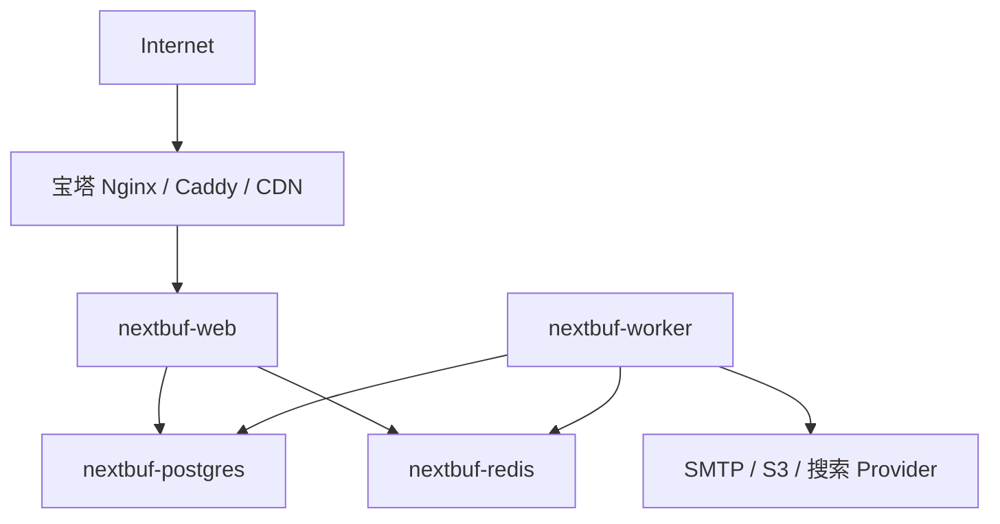

# 部署与运维

本文件定义部署架构和运维原则。逐步安装、升级、备份、恢复和故障排查见 [安装与运维运行手册](./13-installation-operations-runbook.md)。

> 当前实现状态：`v0.2.0` 已提供仅包含 PostgreSQL/Redis 的开发与测试 Compose，并实现 Web、Worker、migrate、setup、doctor 运行入口；尚未提供生产应用镜像和四容器生产 Compose。本文其余发布流程仍是 `v0.12.0` 必须实现的合同。

## 1. 部署目标

NextBuf 的发布方式必须同时服务两类用户：

- 希望在宝塔面板中导入 Compose、填写配置并点击启动的站长。
- 需要外部数据库、多实例、自动发布和可观测性的专业运维团队。

两类用户使用同一个应用镜像和配置模型。简单部署不是另一套代码，专业部署也不要求迁移到“企业版”。

## 2. 默认拓扑：四个常驻容器

**状态：已确定。**



常驻服务：

| 服务 | 镜像 | 对外端口 | 持久化 | 责任 |
| --- | --- | --- | --- | --- |
| `nextbuf-web` | NextBuf 应用镜像 | 3000，可映射到宿主机回环地址 | 可选本地上传目录 | 页面、后台、API |
| `nextbuf-worker` | 与 Web 相同 | 无 | 可选本地上传目录 | 队列和周期任务 |
| `nextbuf-postgres` | 官方 PostgreSQL 镜像 | 默认不对公网发布 | 必需 | 业务事实数据 |
| `nextbuf-redis` | 官方 Redis 镜像 | 默认不对公网发布 | 建议 AOF | 缓存、限流、BullMQ |

一次性 `setup` 服务负责迁移、必要的种子数据和首次初始化。它成功退出后 Web 与 Worker 才启动，因此不计入常驻容器。

## 3. 为什么不是三个容器

Discourse 可以把 Web 和 Sidekiq 放在同一个应用容器，因为它使用 runit 等机制监督多个进程。这是成熟且有效的封装方式，但不是容器数越少越先进。

NextBuf 将 Web 和 Worker 分开，原因是：

- Node Web 与 BullMQ Worker 是两个独立长生命周期进程。
- Worker 的崩溃、任务峰值或内存压力不应直接影响页面可用性。
- 两者需要不同的健康检查、日志、停止宽限期和资源限制。
- 后续可以分别增加 Web 或 Worker 实例。
- 不需要在应用镜像中再维护一个进程监督器。

宝塔用户仍然只导入一个 Compose 项目并点击一次启动。第四个容器增加的是内部隔离，不增加安装流程。

## 4. 一个镜像、两个运行角色

GitHub Actions 只构建一个应用镜像。镜像至少包含：

- Next.js standalone Web 产物。
- 编译后的 Worker 入口和共享领域代码。
- Prisma Client、迁移文件和初始化入口。
- 生产运行所需的静态资源与包。

建议的镜像入口契约：

```text
nextbuf web       启动 Web
nextbuf worker    启动 Worker
nextbuf migrate   执行数据库迁移
nextbuf setup     迁移并完成首次初始化
nextbuf doctor    检查配置和依赖
```

实际可以由一个小型 Node CLI 或 POSIX 入口脚本实现，但必须使用 `exec` 正确转交信号。容器内进程以非 root 用户运行。

## 5. Compose 生命周期

以下是服务关系示意，不是发布前可直接复制的最终文件：

```yaml
services:
  postgres:
    image: postgres:18
    healthcheck: {}
    volumes:
      - postgres_data:/var/lib/postgresql

  redis:
    image: redis:8
    healthcheck: {}
    volumes:
      - redis_data:/data

  setup:
    image: ${NEXTBUF_IMAGE}:${NEXTBUF_VERSION}
    command: ["nextbuf", "setup"]
    restart: "no"
    depends_on:
      postgres:
        condition: service_healthy
      redis:
        condition: service_healthy

  web:
    image: ${NEXTBUF_IMAGE}:${NEXTBUF_VERSION}
    command: ["nextbuf", "web"]
    depends_on:
      setup:
        condition: service_completed_successfully

  worker:
    image: ${NEXTBUF_IMAGE}:${NEXTBUF_VERSION}
    command: ["nextbuf", "worker"]
    depends_on:
      setup:
        condition: service_completed_successfully
```

正式 Compose 必须补充：健康检查、环境变量、只读文件系统可行性、停止宽限期、日志轮转、网络、资源建议和安全选项。

`NEXTBUF_IMAGE` 是正式配置变量。产品名称和镜像组织尚未确定，因此文档不得写死 `ghcr.io/nextbuf/nextbuf`。正式发布时 `.env.example` 提供真实默认镜像地址，私有镜像用户可以覆盖。

PostgreSQL 18 官方镜像使用版本化的 `PGDATA` 布局，命名卷应挂载到 `/var/lib/postgresql`。如果以后显式覆盖 `PGDATA`，卷挂载点必须与之匹配，并通过重建容器后的数据持久化测试验证，不能沿用旧版本路径后假定数据已经进入命名卷。

数据库和 Redis 默认只加入内部网络。只有 Web 端口可以发布，推荐映射为 `127.0.0.1:3000:3000`，再由宝塔 Nginx 反向代理。

## 6. 配置合同

环境变量的正式名称、类型、默认值和服务适用范围见 [配置参考](./12-configuration-reference.md)。实现时若需要改名，必须同时更新配置 Schema、`.env.example`、Compose、安装向导和升级说明，不能只改代码。

### 必需配置

- `APP_URL`：唯一规范外部地址，包含协议。
- `DATABASE_URL`：PostgreSQL 连接串。
- `REDIS_URL`：Redis 连接串。
- `AUTH_SECRET`：会话签名密钥。
- `ENCRYPTION_KEY`：数据库敏感配置的实例级加密主密钥。

### 常用配置

- `PORT`、`HOSTNAME`、`TZ`。
- SMTP 地址、端口、用户名、密码和发件人。
- 本地或 S3 存储 Provider 及对应参数。
- OAuth Client ID、Secret 和回调设置。
- 日志级别、可信代理和上传限制。

规则：

- 提供 `.env.example`，仅包含安全占位符和说明。
- 一键安装脚本使用密码学安全随机源生成密钥。
- 启动时通过 Schema 校验，缺少或格式错误时快速失败。
- Worker 和 Web 读取同一业务配置；只与某个角色相关的变量必须有清晰前缀。
- 环境变量优先于数据库站点设置的范围必须文档化。

## 7. 镜像与版本

### 平台

正式镜像至少发布：

- `linux/amd64`
- `linux/arm64`

### 标签

- `1.2.3`：不可变正式版本，生产推荐。
- `1.2`、`1`：跟随对应兼容线，适合愿意自动获得补丁的用户。
- `edge`：主分支构建，不保证数据升级可回退。
- 不把 `latest` 作为文档中的生产默认值。

发布时生成 SBOM、镜像来源证明和变更日志。基础镜像、PostgreSQL 和 Redis 在仓库中锁定经过测试的版本；文档只写主版本时，Compose 发布文件仍应锁定具体补丁或 digest。

## 8. GitHub Actions 发布流程

建议流程：

1. 检查格式、类型、单元测试和迁移一致性。
2. 构建应用产物并执行集成测试。
3. 使用 Buildx 构建 amd64/arm64 镜像。
4. 启动临时 PostgreSQL、Redis、Web、Worker，执行冒烟测试。
5. 推送 GHCR；稳定版可同步 Docker Hub。
6. 生成校验和、SBOM、版本说明和非 Docker 发布包。
7. 只有带保护规则的版本标签可以发布稳定镜像。

来自外部贡献者的 Pull Request 不接触发布密钥。Actions 权限使用最小范围并固定第三方 Action 的提交版本。

## 9. 宝塔安装流程

目标体验：

1. 下载发布版 Compose 与 `.env.example`，或在面板中导入编排模板。
2. 设置域名、数据库密码、Redis 密码和邮件参数；安装脚本生成内部密钥。
3. 启动 Compose 项目，等待 `setup` 成功完成。
4. 在宝塔网站中添加反向代理到 NextBuf Web 端口并申请 HTTPS。
5. 首次访问安装向导，创建管理员并完成站点基础配置。
6. 在后台执行邮件、队列、上传和定时任务自检。

安装向导不能在已有用户或已完成安装的实例上重新创建管理员。初始化状态必须存入数据库并受一次性令牌保护。

## 10. 非 Docker 部署

发布包包含 Web、Worker、静态资源、迁移和 CLI，不包含 PostgreSQL、Redis。服务器需要：

- Linux x64 或 arm64。
- Node.js 24 LTS。
- 可访问的 PostgreSQL 18 和 Redis 8。
- Nginx、Caddy 或宝塔反向代理。

systemd 推荐创建两个服务：

```text
nextbuf-web.service
nextbuf-worker.service
```

二者使用同一发布目录和环境文件，但分别启动 `nextbuf web` 与 `nextbuf worker`。PM2 方案同样定义两个 app，不能把 Worker 隐藏在 Web 的后台 shell 中。

升级通过新版本目录加稳定符号链接完成，迁移成功后切换。发布文档必须注明哪些数据库迁移不支持直接回退。

## 11. 外部托管依赖

专业部署可以关闭 Compose 内的 PostgreSQL 或 Redis，改用托管服务。要求：

- PostgreSQL 支持项目所需扩展、连接数和备份恢复能力。
- Redis 兼容 BullMQ 所需命令，不能是仅支持部分命令的缓存产品。
- TLS、证书和连接池参数可配置。
- Web 与 Worker 使用相同数据库 Schema 和 Redis 命名空间。
- 多实例使用 S3 兼容存储，不能各自保存本地上传文件。

## 12. 健康检查与停止

### Web

- `live`：Node 事件循环仍响应。
- `ready`：必要数据库和 Redis 连接可用，迁移版本兼容。
- 终止时停止接收新请求，在宽限期内完成活动请求。

### Worker

- `live`：进程与队列消费者仍运行。
- `ready`：数据库、Redis 和任务注册可用。
- 终止时停止领取新任务，并等待当前任务完成或安全释放锁。

数据库短暂故障不应导致无限高频重启。健康检查间隔、超时和启动宽限期需要通过实际慢启动测试确定。

## 13. 备份与恢复

最低备份集合：

- PostgreSQL 一致性备份。
- 本地上传目录，或对象存储版本/生命周期策略。
- 实例配置和加密密钥的安全副本。
- 当前应用版本、Compose 文件和迁移版本记录。

Redis 不作为业务事实来源，通常不进入核心灾难恢复备份，但 AOF 有助于短时队列恢复。关键任务依靠 Outbox 从 PostgreSQL 重新投递。

恢复演练必须验证：

1. 在空环境恢复数据库和附件。
2. 使用正确密钥启动指定应用版本。
3. 登录、读取主题、上传和发送测试邮件。
4. Worker 能继续处理 Outbox 和队列。
5. 记录恢复时间目标和实际耗时。

未经恢复演练的备份不能视为可靠备份。

## 14. 升级与回滚

标准升级：

1. 阅读变更日志和兼容说明。
2. 创建并验证数据库、附件和密钥备份。
3. 拉取精确版本镜像。
4. 运行预检查和迁移任务。
5. 更新 Web 与 Worker，执行健康检查和冒烟测试。
6. 观察错误率、队列积压和关键业务流程。

数据库迁移遵循 expand/contract：先增加兼容结构并发布兼容代码，确认稳定后再在后续版本删除旧结构。若某次迁移不可逆，发布说明必须明确指出；不能承诺仅切回旧镜像就一定可以回滚。

## 15. 最低资源与容量

在完成压力测试前不承诺固定并发或“最低 1 GB 可运行”。首次正式发布前需要给出经过验证的档位：

- 开发/试用。
- 小型生产。
- 中型单机。
- 外部数据库和横向扩展。

资源建议必须说明 Web 并发、Worker 并发、PostgreSQL 缓冲、Redis 内存和图片处理峰值，而不只给出一个总内存数字。
