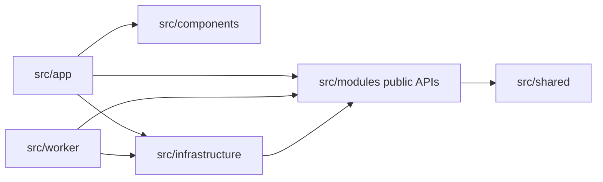

# 仓库结构与模块边界

本文是创建工程和新增模块时必须遵守的目录合同。它回答代码放在哪里、哪些代码可以互相导入，以及 Next.js 全栈代码如何避免服务端内容进入浏览器。

## 1. 核心决策

- 所有应用源码放在 `src/`。
- Next.js App Router 位于 `src/app/`。
- 不创建顶层 `frontend/` 和 `backend/` 两个工程。
- 前台和管理后台是同一个 Next.js 应用中的两个路由区域。
- Web 与 Worker 使用同一套领域和基础设施代码，但以不同进程运行。
- 通过目录、`server-only`、文件后缀和 lint 规则建立运行边界。

new-api 和 sub2api 的前后端使用不同语言与构建工具，因此需要独立目录。NextBuf 的 React 页面、Server Components、Route Handlers、Server Actions 和 Node 服务端都由 Next.js/TypeScript 提供，拆成两个工程只会增加重复类型、认证和构建边界。

## 2. 标准目录

```text
NextBuf/
├─ src/
│  ├─ app/
│  │  ├─ (site)/              社区前台路由
│  │  ├─ admin/               管理后台路由
│  │  ├─ api/                 Route Handlers
│  │  ├─ layout.tsx
│  │  ├─ auth/                 登录、注册、验证和重置页面
│  │  ├─ account/security/     登录设备与会话管理
│  │  ├─ error.tsx
│  │  └─ not-found.tsx
│  ├─ components/
│  │  ├─ ui/                  shadcn/ui 与通用界面原语
│  │  ├─ layout/              导航、三栏框架、页脚
│  │  ├─ community/           主题、回复、节点展示组件
│  │  ├─ auth/                身份表单与会话管理组件
│  │  └─ admin/               后台专用展示组件
│  ├─ modules/
│  │  ├─ identity/
│  │  ├─ profiles/
│  │  ├─ community/
│  │  ├─ interactions/
│  │  ├─ notifications/
│  │  ├─ moderation/
│  │  ├─ trust/
│  │  ├─ settings/
│  │  └─ audit/
│  ├─ infrastructure/
│  │  ├─ database/
│  │  ├─ cache/
│  │  ├─ queue/
│  │  ├─ auth/                Better Auth、Prisma adapter、Redis 限流
│  │  ├─ mail/                加密载荷、Outbox 入队与 SMTP
│  │  ├─ storage/
│  │  ├─ search/
│  │  └─ observability/
│  ├─ worker/
│  │  ├─ index.ts             Worker 进程入口
│  │  ├─ runtime.ts           心跳、Dispatcher 和优雅停止
│  │  ├─ registry.ts          任务注册
│  │  ├─ schedulers.ts        周期任务注册
│  │  └─ processors/          队列处理器
│  ├─ cli/
│  │  ├─ index.ts             web/worker/migrate/setup/doctor/invite 入口
│  │  └─ commands/            可组合的运行命令
│  └─ shared/
│     ├─ contracts/           稳定的跨模块类型
│     ├─ errors/              通用错误基类
│     ├─ validation/          与领域无关的验证辅助
│     └─ utils/               极少量无领域归属工具
├─ prisma/
│  ├─ schema.prisma
│  ├─ migrations/
│  └─ seed.ts
├─ public/                    浏览器可直接访问的静态资源
├─ scripts/
│  └─ prepare-standalone.mjs  整理本地/发布用 standalone 静态资源
├─ tests/
│  ├─ unit/
│  ├─ integration/
│  ├─ e2e/
│  └─ fixtures/
├─ deploy/
│  ├─ compose/
│  ├─ systemd/
│  ├─ nginx/
│  └─ scripts/
├─ docs/
├─ UI/                        历史设计原型，仅作视觉参考
├─ playwright.config.ts       多视口浏览器测试与 standalone Web 启动
├─ package.json
├─ pnpm-lock.yaml
├─ Dockerfile
└─ compose.yml
```

## 3. 各层职责

### `src/app`

只负责路由和传输层：

- 页面布局和路由参数。
- 读取认证上下文。
- 解析表单或 HTTP 输入。
- 调用模块公开的应用用例。
- 将结果转换为页面 ViewModel 或 API 响应。

不得在页面、Route Handler 或 Server Action 中直接写复杂 Prisma 查询、计算信任等级或拼接治理规则。

### `src/components`

负责视觉和交互。组件接收已经准备好的数据，通过明确回调或 Action 发起操作。

- `ui` 不依赖任何业务模块。
- `community` 可以依赖公开 ViewModel 和客户端安全类型。
- `admin` 只表示后台界面，不意味着拥有管理员权限；权限仍在服务端验证。
- 全局页脚中的 NextBuf 法律署名属于核心组件，不能作为普通站点设置、主题开关或插件插槽被删除。

### `src/modules`

每个模块拥有自己的业务规则、用例、仓储接口和公开合同。建议按实际复杂度选择以下内部目录：

```text
community/
├─ domain/              实体、值对象、状态规则
├─ application/         createTopic、replyToTopic 等用例
├─ repositories/        仓储接口与模块查询
├─ policies/            模块授权策略
├─ events/              领域事件定义
└─ index.server.ts      服务端公开入口
```

简单模块不需要机械地创建全部空目录。其他模块只能通过 `index.server.ts` 或明确公开的合同访问，禁止深层导入内部实现。

### `src/infrastructure`

提供 Prisma、Redis、BullMQ、邮件、存储和搜索等技术实现。基础设施可以实现模块声明的接口，但不能反过来定义业务规则。

### `src/worker`

只负责启动队列消费者、调度器和任务处理器。处理器解析任务 payload 后调用模块应用用例，不复制 Web 中的业务代码。

### `src/cli`

提供 Web、Worker、迁移、setup、doctor 和邀请码管理的统一 Node 入口。CLI 可以组装基础设施并调用 Prisma/Next.js 官方入口，但不能重新实现领域规则，也不能在输出中泄露连接串或密钥。邀请码明文只能在创建时输出一次。

### `src/shared`

只存放真正跨模块、没有领域所有者的稳定代码。禁止把无法归类的代码全部丢进 `shared`。用户、主题、信任等业务类型应由对应模块拥有。

## 4. 服务端与客户端边界

以下目录默认是服务端代码：

```text
src/modules/
src/infrastructure/
src/worker/
src/cli/
```

服务端入口添加：

```ts
import "server-only";
```

命名规则：

- `*.server.ts`：只能在 Node/服务端使用。
- `*.client.tsx`：明确的 Client Component 或客户端适配器。
- 普通 `.tsx` 默认优先作为 Server Component。
- 共享给浏览器的 DTO 不得包含密码哈希、密钥、内部审计字段或数据库连接类型。
- `*.client.tsx` 只能从业务模块导入 `import type` 的公开浏览器安全合同；ESLint 禁止导入模块实现、基础设施、Worker 和服务端配置。

必须配置 lint/import 规则阻止：

- Client Component 导入 Prisma、Redis、BullMQ、`process.env` 服务端配置。
- `components/ui` 导入业务模块。
- 模块深层导入另一个模块的内部文件。
- Worker 导入 Next.js 页面组件。

## 5. 模块依赖

允许的主要依赖方向：



图中的 `APP -> INFRA` 只允许用于组装依赖、读取连接状态等适配工作，业务路由不能绕过模块直接操作数据库。

禁止：

- `identity` 直接修改 `community` 表。
- `trust` 从页面组件读取统计后自行决定等级。
- `moderation` 通过 Redis 缓存代替 PostgreSQL 制裁事实。
- 为复用一段代码制造循环依赖。

跨模块操作使用应用编排服务或领域事件，并明确事务边界。

## 6. 路由结构

建议：

```text
src/app/
├─ (site)/
│  ├─ page.tsx                 首页
│  ├─ nodes/[slug]/page.tsx    节点页
│  ├─ topics/[id]/page.tsx     主题页
│  └─ members/[username]/      用户公开页
├─ account/                    登录用户账号中心
├─ auth/                       登录、注册、验证和重置页面
├─ admin/                      后台
└─ api/
   ├─ auth/[...all]/           Better Auth 处理入口
   ├─ identity/register/       NextBuf 注册策略边界
   ├─ internal/               站内专用接口，不视为公开合同
   └─ v1/                     V2.0.0 后的公开 API
```

Route Group 不改变 URL。后台使用 `/admin`，账号中心使用 `/account`。公开 API 在正式冻结前不能提前标记为稳定 `v1` 合同。

## 7. 路径别名

建议统一：

```text
@/app/*
@/components/*
@/modules/*
@/infrastructure/*
@/worker/*
@/shared/*
```

不创建含义重叠的 `@/lib`、`@/utils`、`@/services` 全局垃圾目录。确需增加时先说明所有权和依赖方向。

## 8. 新增功能放置流程

1. 确定功能属于哪个领域模块。
2. 在模块中定义用例、权限和数据合同。
3. 添加迁移与仓储实现。
4. 若需要异步处理，在 `src/worker` 注册处理器并调用模块用例。
5. 在 `src/app` 建立路由，在 `src/components` 建立界面。
6. 添加单元、集成和 E2E 测试。
7. 更新对应产品、API、配置或部署文档。

如果一个功能无法判断归属，先解决领域边界，不要通过新建顶层目录逃避问题。
